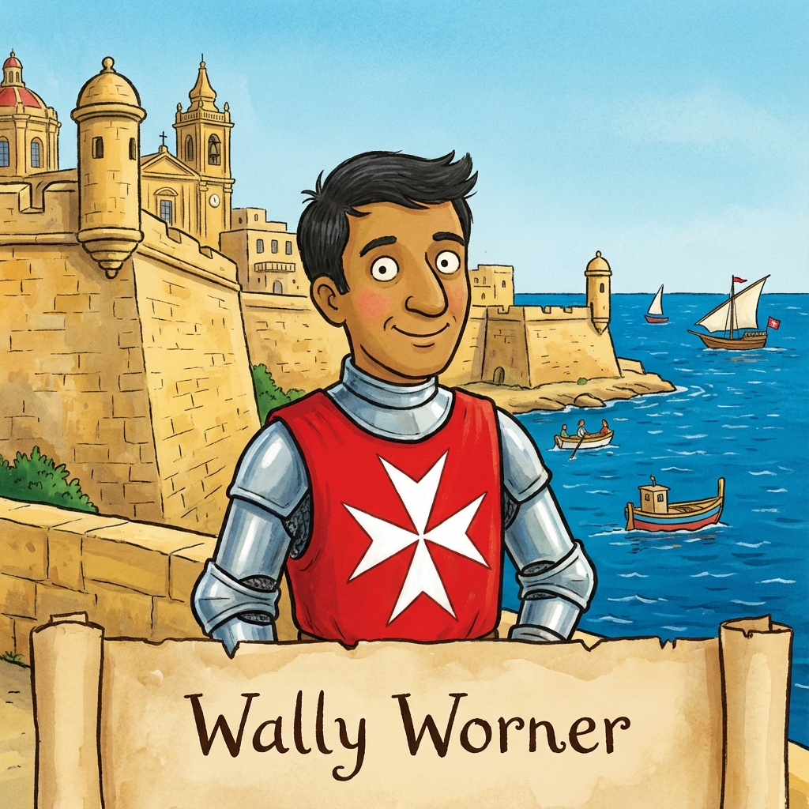
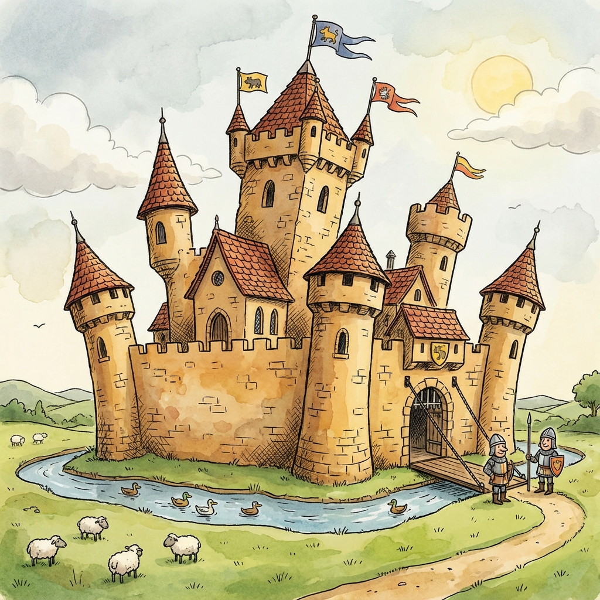
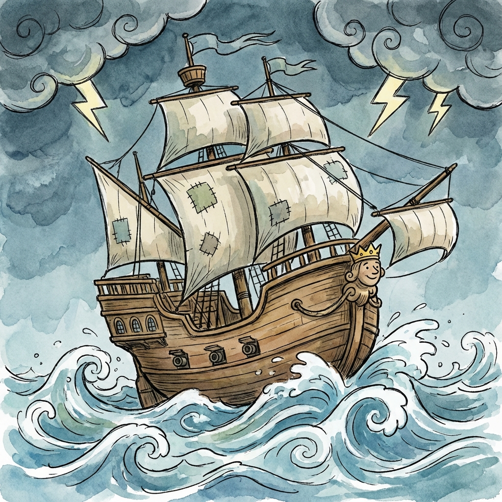

<!DOCTYPE html>
<html lang="en">
<head>
    <meta charset="UTF-8">
    <meta name="viewport" content="width=device-width, initial-scale=1.0">
    <title>Sir Worner and the Siege of Senglea</title>
    
</head>
<body>
    

        <!-- Page 1: Title -->
        

            

                
            

            

                <h1>Sir Worner and the Siege of Senglea</h1>
                
<strong>A Tale of Courage and Honor</strong>

                
Long ago in 1565, there lived a brave knight named Sir Worner. His name meant "guardian warrior," and he carried a bright yellow shield with a bold red stripe and six red flowers.

                
His family motto was: <em>"Non nobis tantum nati"</em> — "Not born for ourselves alone."

                
This is the story of how Sir Worner helped save Malta and defended a special house that would shine like a star through the centuries...

            

            
Page 1

        

        <!-- Page 2: The Call -->
        

            

                
            

            

                <h1>The Call to Malta</h1>
                
One spring morning, a messenger arrived at Sir Worner's castle with urgent news. The beautiful island of Malta was in terrible danger!

                
The Ottoman Empire had sent hundreds of ships carrying thousands of soldiers to capture the island. Malta was defended by the Knights of St. John, led by the great Grand Master Jean de la Valette, but they were outnumbered ten to one.

                
Sir Worner looked at his coat of arms. He thought about his motto. Then he made his decision.

                
<em>"I must go," he told his squire Thomas. "Others need protection, and that is what a Worner does."</em>

            

            
Page 2

        

        <!-- Page 3: The Voyage -->
        

            

                
            

            

                <h1>The Journey Across the Sea</h1>
                
The voyage across the Mediterranean Sea was Sir Worner's first great adventure. His ship battled terrible storms. Lightning cracked the sky, and waves as tall as castles crashed over the deck.

                
One night, when all seemed lost, Sir Worner noticed something strange—the stars were arranged in a pattern he'd never seen before. Following his instincts, he convinced the captain to change course.

                
The next morning, they sailed into calm waters and spotted Malta on the horizon.

                
<em>"How did you know?"</em> asked Thomas, amazed.

                
<em>"Sometimes, a guardian must trust his heart as much as his sword,"</em> Sir Worner replied with a smile.

            

            
Page 3

        

        <!-- Page 4: Meeting Valette -->
        

            

                
            

            

                <h1>Meeting Jean de la Valette</h1>
                
When Sir Worner arrived at Malta, the island was already under siege. He was brought before Jean de la Valette himself—a legendary warrior with steel-gray hair and eyes that had seen a thousand battles.

                
<em>"Sir Worner, your motto—'Not born for ourselves alone.' We shall need men who believe such words. The Ottoman forces will strike at Senglea, the peninsula fortress. It is the key to our harbor. If Senglea falls, Malta falls."</em>

                
<em>"Then Senglea must not fall,"</em> Sir Worner said firmly.

                
Jean de la Valette smiled for the first time in weeks. <em>"You will fight alongside me. Come, let me show you the fortress that will be your home—and perhaps your glory."</em>

            

            
Page 4

        

        <!-- Page 5: Senglea -->
        

            

                
            

            

                <h1>The House Called Stella</h1>
                
That night, Sir Worner explored the streets of Senglea. He walked down Triq il-Kurcifiss—the Street of the Crucifix. One house in particular caught his eye: number 38. It was strong, built of golden limestone, with a perfect view of the harbor.

                
An old woman gave him bread. <em>"Protect us, Sir Knight. This house has been in my family for generations."</em>

                
<em>"I will,"</em> Sir Worner promised. <em>"This place will stand."</em>

                
Little did he know that this house would become legendary—a shining star in Malta's darkest hour.

            

            
Page 5

        

        <!-- Page 6: The Battle -->
        

            

                
            

            

                <h1>The Great Battle for Senglea</h1>
                
On August 7th, 1565, the Ottomans launched their greatest assault. They attacked from both land and sea! Thousands of soldiers charged while boats filled with warriors approached from the harbor.

                
Jean de la Valette turned to Sir Worner: <em>"Take command of the harbor defenses. I trust you."</em>

                
Sir Worner had a brilliant idea. He positioned cannons in the houses along Triq il-Kurcifiss, especially number 38. From its windows, they could see the entire harbor approach!

                
The house became a fortress within a fortress. Its thick walls absorbed enemy fire. Sir Worner fought from room to room, window to window, directing his men with precision.

                
All day the battle raged. By sunset, the Ottoman forces retreated. Senglea still stood, and number 38 had been the key to the harbor's defense!

            

            
Page 6

        

        <!-- Page 7: The Gift -->
        

            

                

                    
                    
                

            

            

                <h1>Stella - The Star</h1>
                
That evening, Jean de la Valette found Sir Worner outside number 38.

                
<em>"Today you saved Senglea. Your command from that house turned the tide of battle."</em>

                
The Grand Master looked up at the house, still smoking from battle but standing proud and strong.

                
<em>"This house needs a name. It stood like a star of hope in our darkest hour. Let us call it 'Stella'—the Star."</em>

                
Then Valette removed a ring from his finger—a band with the cross of the Knights of St. John.

                
<em>"I want you to have Stella—number 38 Triq il-Kurcifiss. It is yours, for you and your family, for all generations to come."</em>

                
Sir Worner accepted with tears in his eyes. <em>"The Star. I will ensure it shines for generations."</em>

            

            
Page 7

        

        <!-- Page 8: The Legacy -->
        

            

                

                    
                    
                

            

            

                <h1>The Legacy Lives On</h1>
                
The siege continued, but the great assault on Senglea was the turning point. The Ottoman forces eventually sailed away. Malta was saved!

                
Sir Worner made Stella his home. He restored its battle-damaged walls, planted flowers in its windows, and filled it with warmth and laughter. The house became a gathering place where Jean de la Valette was a frequent guest.

                
Years passed, then decades, then centuries. Stella remained, passed down through generations. Each generation added their stories, but never forgot the brave knight who defended it during the Great Siege.

                
People walking down Triq il-Kurcifiss would pause at number 38. "Stella," they would say. "The Star that helped save Malta."

                
And today, Stella still stands—a reminder that we are <em>Non nobis tantum nati</em>—not born for ourselves alone.

            

            
Page 8

        

        

            <button id="prevBtn" onclick="previousPage()">← Previous</button>
            <button id="nextBtn" onclick="nextPage()">Next →</button>
        

    

    
</body>
</html>